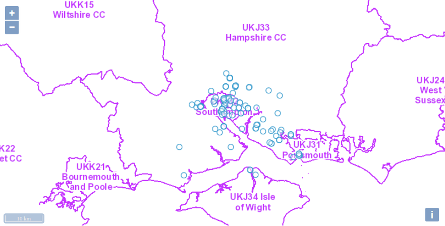

# Vector Layers

Vector Layers are represented by `ol.layer.Vector` and handle the client-side display of vector data. Currently OpenLayers 3 supports full vector rendering in the Canvas renderer, but only point geometries in the WebGL renderer.

## Rendering Features Client-Side

Let's go back to the WMS example to get a basic world map.  We'll add some feature data on top of this in a vector layer.

```html
<!doctype html>
<html lang="en">
  <head>
    <meta charset="UTF-8">
    <link rel="stylesheet" href="libs/ol.css" type="text/css">
    <style>
      #map {
        height: 256px;
        width: 512px;
      }
    </style>
    <title>OpenLayers 3 example</title>
    <script src="libs/ol.js" type="text/javascript"></script>
  </head>
  <body>
    <h1>My Map</h1>
    <div id="map"></div>
    <script type="text/javascript">
      var map = new ol.Map({
        target: 'map',
        layers: [
          new ol.layer.Tile({
            title: 'Global Imagery',
            source: new ol.source.TileWMS({
              url: 'http://demo.opengeo.org/geoserver/wms',
              params: {LAYERS: 'nasa:bluemarble', VERSION: '1.1.1'}
            })
          })
        ],
        view: new ol.View({
          projection: 'EPSG:4326',
          center: [0, 0],
          zoom: 1,
          maxResolution: 0.703125
        })
      });
    </script>
  </body>
</html>
```

### Tasks

1. Open `map.html` in your text editor and copy in the contents of the initial WMS example. Save your changes and confirm that things look good in your browser: {{ book.workshopUrl }}/map.html

1. In your map initialization code add another layer after the Tile layer (paste the following). This adds a new vector layer to your map that requests a set of features stored in GeoJSON:

  ```js
    new ol.layer.Vector({
      title: 'Earthquakes',
      source: new ol.source.Vector({
        url: '../data/layers/7day-M2.5.json',
        format: new ol.format.GeoJSON()
      }),
      style: new ol.style.Style({
        image: new ol.style.Circle({
          radius: 3,
          fill: new ol.style.Fill({color: 'white'})
        })
      })
    })
  ```

  

1. Reuse the WMS projected code and like above add your own GeoJSON. In the `data` directory, you will find a file named `amenities-atm.geojson`. The result should look like below. Points style may change according to your mileage.

  


### A Closer Look

Let's examine that vector layer creation to get an idea of what is going on.

```jsh2geo.json
new ol.layer.Vector({
  title: 'Earthquakes',
  source: new ol.source.Vector({
    url: '../data/layers/7day-M2.5.json',
    format: new ol.format.GeoJSON()
  }),
  style: new ol.style.Style({
    image: new ol.style.Circle({
      radius: 3,
      fill: new ol.style.Fill({color: 'white'})
    })
  })
})
```

The layer is given the title `'Earthquakes'` and some custom options. In the options object, we've included a `source` of type `ol.source.Vector` which points to a url. We've given the source a `format` that will be used for parsing the data.

*Note* - In the case where you want to style the features based on an attribute, you would use a style function instead of an `ol.style.Style` for the `style` config option of `ol.layer.Vector`.

### Bonus Tasks

1.  The white circles on the map represent `ol.Feature` objects on your `ol.layer.Vector` layer. Each of these features has attribute data with `title` and `summary` properties. Register a `'singleclick'` listener on your map that calls `forEachFeatureAtPixel` on the map, and displays earthquake information below the map viewport.

1.  The data for the vector layer comes from an earthquake feed published by the USGS (http://earthquake.usgs.gov/earthquakes/catalogs/).  See if you can find additional data with spatial information in a format supported by OpenLayers 3.  If you save another document representing spatial data in your `data` directory, you should be able to view it in a vector layer on your map.

### Solutions

As a solution to the first bonus task you can add an `info` div below the map:

```html
<div id="info"></div>
```

and add the following JavaScript code to display the title of the clicked
feature:

```js
map.on('singleclick', function(e) {
  var feature = map.forEachFeatureAtPixel(e.pixel, function(feature) {
    return feature;
  });
  var infoElement = document.getElementById('info');
  infoElement.innerHTML = feature ? feature.get('title') : '';
});
```
