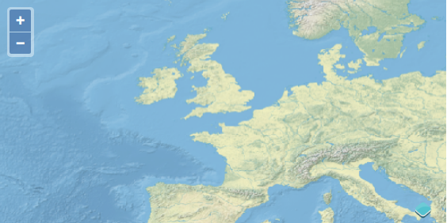
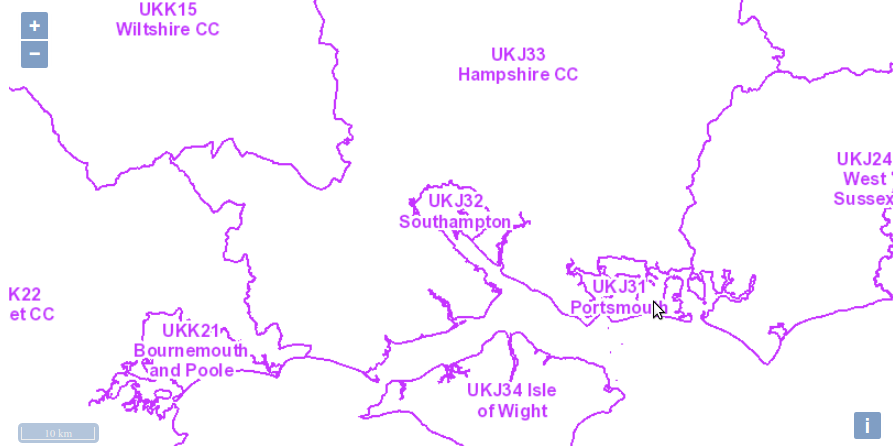

# Web Map Service Layers

When you add a layer to your map, the layer's source is typically responsible for fetching the data to be displayed. The data requested can be either raster or vector data. You can think of raster data as information rendered as an image on the server side. Vector data is delivered as structured information from the server and may be rendered for display on the client (your browser).

There are many different types of services that provide raster map data. This section deals with providers that conform with the OGC (Open Geospatial Consortium, Inc.) [Web Map Service (WMS)](http://www.opengeospatial.org/standards/wms) specification.

## Creating a Layer

We'll start with a fully working map example and modify the layers to get an
understanding of how they work.

Let's take a look at the following code:

```html
<!doctype html>
<html lang="en">
  <head>
    <meta charset="UTF-8">
    <link rel="stylesheet" href="libs/ol.css" type="text/css">
    <style>
      #map {
        height: 256px;
        width: 512px;
      }
    </style>
    <script src="libs/ol.js" type="text/javascript"></script>
    <title>OpenLayers 3 example</title>
  </head>
  <body>
    <h1>My Map</h1>
    <div id="map"></div>
    <script type="text/javascript">
      var map = new ol.Map({
        target: 'map',
        layers: [
          new ol.layer.Tile({
            title: 'Global Imagery',
            source: new ol.source.TileWMS({
              url: 'http://demo.opengeo.org/geoserver/wms',
              params: {LAYERS: 'nasa:bluemarble', VERSION: '1.1.1'}
            })
          })
        ],
        view: new ol.View({
          projection: 'EPSG:4326',
          center: [-1.4042, 50.9028],
          zoom: 3,
          maxResolution: 0.703125
        })
      });
    </script>
  </body>
</html>
```

### Tasks

1. If you haven't already done so, save the text above as `map.html` in the root of your workshop directory.

1. Open the page in your browser to confirm things work: {{ book.workshopUrl }}/map.html

## The `ol.layer.Tile` Constructor

The `ol.layer.Tile` constructor gets an object literal of type `olx.layer.TileOptions` see: http://openlayers.org/en/master/apidoc/ol.layer.Tile.html
In this case we are providing the source key of the options with an `ol.source.TileWMS`.
A human-readable title for the layer can be provided with the title key, but basically any arbitrary name for the key can be used here.
In OpenLayers 3 there is a separation between layers and sources, whereas in OpenLayers 2 this was all part of the layer.

`ol.layer.Tile` represents a regular grid of images, `ol.layer.Image` represents a single image. Depending on the layer type, you would use a different source (`ol.source.TileWMS` versus `ol.source.ImageWMS`) as well.

## The ol.source.TileWMS Constructor

The `ol.source.TileWMS` constructor has a single argument which is defined by: http://openlayers.org/en/master/apidoc/ol.source.TileWMS.html.
The url is the online resource of the WMS service, and params is an object literal with the parameter names and their values. Since the default WMS version is 1.3.0 now in OpenLayers, you might need to provide a lower version in the params if your WMS does not support WMS 1.3.0.

```js
  layers: [
    new ol.layer.Tile({
      title: 'Global Imagery',
      source: new ol.source.TileWMS({
        url: 'http://demo.opengeo.org/geoserver/wms',
        params: {LAYERS: 'nasa:bluemarble', VERSION: '1.1.1'}
      })
    })
  ]
```

### Tasks

1. This same WMS offers a [Natural Earth](http://www.naturalearthdata.com/) layer named `'ne:NE1_HR_LC_SR_W_DR'`. Change the value of the `LAYERS` parameter from `'nasa:bluemarble'` to `'ne:NE1_HR_LC_SR_W_DR'`.

  Your revised ol.layer.Tile Constructor should look like:

  ```js
    new ol.layer.Tile({
      title: 'Global Imagery',
      source: new ol.source.TileWMS({
        url: 'http://demo.opengeo.org/geoserver/wms',
        params: {LAYERS: 'ne:NE1_HR_LC_SR_W_DR', VERSION: '1.1.1'}
      })
    })
  ```

1. Change your layer and source to have a single image instead of tiles. Look at the following API doc pages for hints: http://openlayers.org/en/master/apidoc/ol.layer.Image.html and http://openlayers.org/en/master/apidoc/ol.source.ImageWMS.html. Use the Network tab of your browser's developer tools to make sure a single image is requested and not 256x256 pixel tiles.

  

## Creating a layer with a projection

Copy and paste the following code

```
    <script>
      var extent = ol.proj.transformExtent([-8.74, 49.81, 1.84, 60.9], 'EPSG:4326', 'EPSG:27700');
      var projection = ol.proj.get('EPSG:27700');
      projection.setExtent(extent);

      var layers = [
        new ol.layer.Image({
          extent: extent,
          source: new ol.source.ImageWMS({
            url: 'https://mapping.statistics.gov.uk/arcgis/services/NUTS3/NUTS3_JAN_2012_EW_BGC/MapServer/WmsServer',
            attributions: '©  <a href="https://www.ons.gov.uk/">Office for National Statistics - 2012</a>',
            params: {
              'LAYERS': '0',
              'FORMAT': 'image/png',
              'VERSION': '1.1.1',
              'STYLES=': '' // Dirty hack to bypass https://github.com/openlayers/ol3/issues/5430
            }
          })
        })
      ];

      var map = new ol.Map({
        controls: ol.control.defaults().extend([
          new ol.control.ScaleLine()
        ]),
        layers: layers,
        target: 'map',
        view: new ol.View({
          projection: projection,
          center: ol.proj.fromLonLat([-1.4042, 50.9028], projection),
          extent: extent,
          zoom: 5
        })
      });

    </script>
```

You should also reference proj4js and the EPSG code for the usual projection we want to use for UK (OSGB 1936 / British National Grid, EPSG code 27700). You should insert before application code the following:

```
    <script src="libs/proj4.js"></script>
    <script src="libs/27700.js"></script>
```




Proj4js is a JavaScript port of Proj, a library to manage projections in the browser. Openlayers only support Spherical Mercator (EPSG 3857) and WGS 84 (EPSG 4326). This external library avoid maintaining projections in OpenLayers core library.

You may wonder why we already talk about projections. It's just because if you don't manage them, you will be too restricted for the workshop purpose.


Having worked with dynamically rendered data from a Web Map Service, let's move
on to learn about [cached tile services](cached.md).
